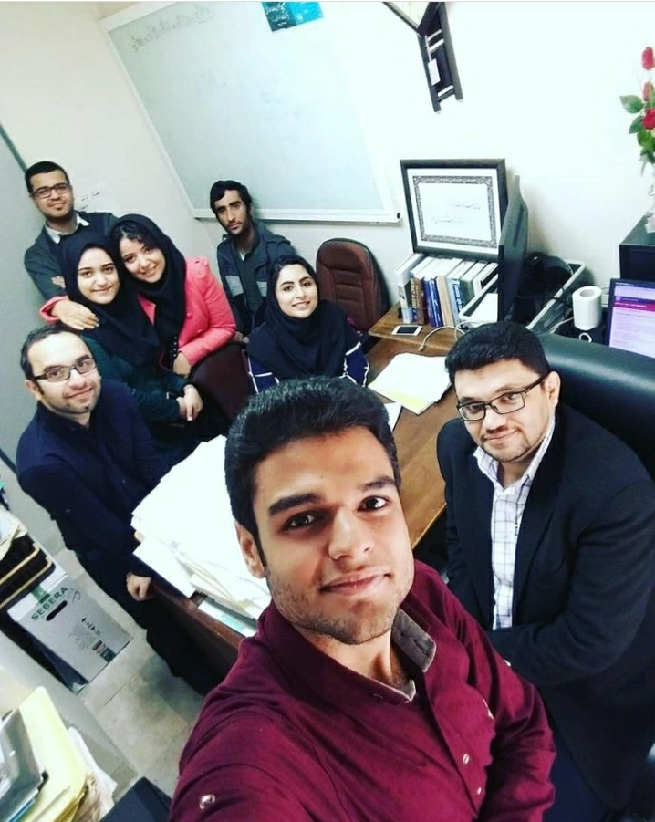

# Pyrhon Theaching
### Teach Python at Persian Gulf University

By:
## Dr. Reza Sharafdini

See the [Weblog](https://sharafdini.github.io/Pyrhon-Teaching/) course.

## Titles:
#### [1. Data Science with Python](https://nbviewer.jupyter.org/github/sharafdini/Pyrhon-Teaching/blob/main/DataSci_Python00/9%20esfand.ipynb)
